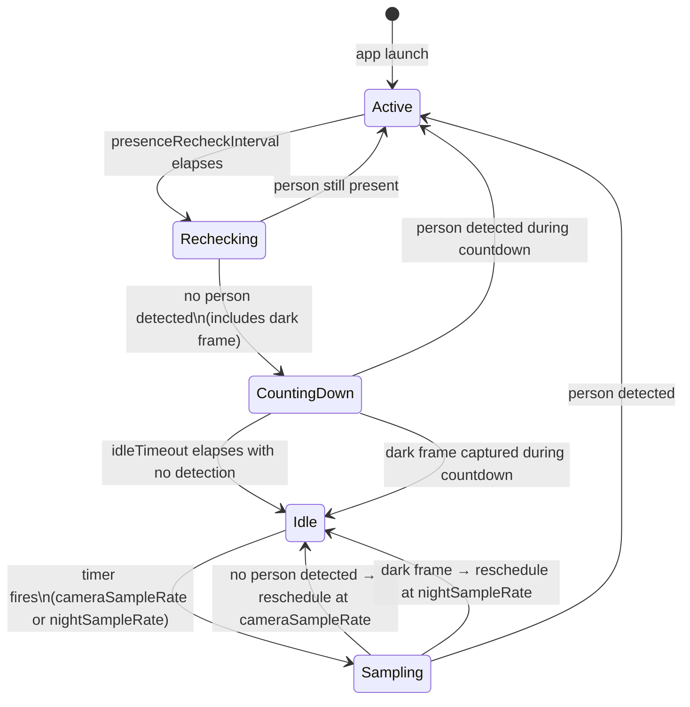

# Presence pipeline

**Status:** Implemented  
**Source files:** `Presence/PresenceDetector.swift`, `KioskManager.swift`, `AppSettings.swift`

---

## Presence modes

DashPad offers three presence modes, selected via `AppSettings.presenceMode` (a `PresenceMode` enum):

| Mode | Behaviour | Camera used? |
|---|---|---|
| `.automatic` | Camera-based detection pipeline described in this document. | Yes |
| `.schedule` | Fixed Active windows defined by time of day. `KioskManager` runs a 60-second timer and evaluates the current time against `AppSettings.weeklySchedule`. | No |
| `.alwaysActive` | Display stays active permanently. | No |

`KioskManager.setPresenceMode(_:)` tears down the current mode's resources and starts the new one. On app launch `KioskManager.start(settings:)` dispatches to the right mode immediately.

**Migration from the old `presenceEnabled` bool:** on the first launch after update, if `presenceMode` has not yet been saved, `AppSettings` reads the legacy `presenceEnabled` key and converts it - `true` → `.automatic`, `false` → `.alwaysActive`. The legacy key is left in place to allow downgrade.

The remainder of this document covers the **Automatic (Camera)** mode exclusively. For the schedule mode data model and logic, see `AppSettings.swift` (`ScheduleWindow`, `WeeklySchedule`) and `KioskManager.swift` (`evaluateSchedule()`, `manualWake()`).

---

## Overview

The camera presence pipeline answers one question: is someone standing in front of the iPad right now? It is designed around two hard constraints - privacy (the camera should be active as little as possible) and battery (Vision is cheap; running an `AVCaptureSession` continuously is not).

The solution is a burst-capture model. Rather than keeping a camera session open and processing a live video stream, each sample starts a fresh `AVCaptureSession`, waits approximately 3 seconds for auto-exposure to converge, grabs a single video frame, then immediately tears the session down. The camera LED is on for roughly 3 seconds per sample and off the rest of the time.

A luminance check on the captured frame gates the Vision request. If the room is dark, the frame is discarded without running the detector and the next sample is pushed out to the slower night rate. This removes any dependency on `UIScreen.brightness` or ambient light sensor APIs, and works correctly even when DashPad is managing screen brightness itself.

---

## Key classes

### `PresenceDetector`

Owns everything camera-related. Exposes a single public method:

```swift
func captureOnce(detectionMode: DetectionMode, darkLuminanceThreshold: Double)
```

Calling `captureOnce()` starts the capture sequence described above. When complete, it calls back on the main thread via:

```swift
var onCaptureResult: ((CaptureResult) -> Void)?
```

`PresenceDetector` is intentionally stateless with respect to the presence logic - it captures and reports, nothing more. It does not know about the state machine, timers, or display transitions. All of that lives in `KioskManager`.

`CaptureResult` carries three values:

```swift
struct CaptureResult {
    let luminance: Double                          // average frame luminance, 0–255
    let observations: [VNDetectedObjectObservation] // empty if dark or no detection
    let debugImage: UIImage?                        // last captured frame, for debug UI only
}
```

### `KioskManager`

Owns the state machine and all timers. When a timer fires, it calls `PresenceDetector.captureOnce()` and processes the resulting `CaptureResult` to decide the next state transition.

---

## Capture sequence

Each call to `captureOnce()` follows this sequence:

1. Request camera permission if not already granted. On denial, call back with `luminance: 0, observations: []` so the state machine can schedule a retry normally.
2. Create a new `AVCaptureSession` with preset `.medium` (640×480).
3. Attach `AVCaptureVideoDataOutput` with `BGRA` pixel format.
4. Configure the output connection: set `videoRotationAngle` to match the current interface orientation, set `isVideoMirrored = true` so the debug image appears natural.
5. Start the session.
6. After 3 seconds, set `readyToCapture = true`. This is the auto-exposure warm-up window.
7. On the next arriving video frame after `readyToCapture` becomes true, capture the frame, stop the session, and proceed to analysis.

**Why `.medium` and not `.low`?** The `.low` preset caps ISO and reduces sensor area, which produces underexposed frames in typical indoor lighting. `.medium` (640×480) gives Vision enough resolution while keeping decode cost low.

**Why `AVCaptureVideoDataOutput` and not `AVCapturePhotoOutput`?** `AVCapturePhotoOutput` maintains a separate AE pipeline from the video output. In practice this means the captured still is incorrectly exposed regardless of warm-up time. Using the video output ensures the AE that has been settling during warm-up is exactly what produces the captured frame.

**Why 3 seconds warm-up?** Testing across a range of lighting conditions showed that AE consistently converges within 2–3 seconds from a cold session start. 3 seconds is the conservative value chosen to avoid capturing underexposed frames that would incorrectly read as dark.

---

## Luminance check

After capturing the frame, average luminance is computed directly from the `CVPixelBuffer` using BT.601 luma weights:

```
Y = 0.299R + 0.587G + 0.114B
```

The computation samples every 8th pixel in both axes (a 64× reduction) for speed. The result is accurate enough for a simple threshold decision - it does not need to be precise.

If `luminance < darkLuminanceThreshold` (default: 20), the frame is treated as dark. The Vision request is skipped, and `CaptureResult` is returned with an empty `observations` array. `KioskManager` interprets a dark result as "room is dark" and schedules the next sample at `nightSampleRate`.

The threshold of 20 (on a 0–255 scale) corresponds to a very dim room - well below typical occupied-room lighting. It is configurable in settings if a specific installation needs a different value.

---

## Vision request

If the frame is not dark, it is passed to a `VNImageRequestHandler` running one of two requests depending on `detectionMode`:

| Mode | Request | Notes |
|---|---|---|
| `body` | `VNDetectHumanRectanglesRequest` | Detects full or partial human silhouettes. Works for side profiles and people facing away. Slightly slower than face detection. |
| `face` | `VNDetectFaceRectanglesRequest` | Detects faces only. Faster, but will not trigger if the person's face is not visible. |

The request runs synchronously on the session queue while the `CVPixelBuffer` is still valid (before the session tears down and the buffer is released). Results are returned as `[VNDetectedObjectObservation]`. The state machine considers any non-empty observations array as "person detected."

The pixel buffer is pre-rotated and mirrored via the connection settings (step 4 of the capture sequence), so the `VNImageRequestHandler` is initialised without a separate orientation parameter.

---

## State machine

The state machine lives entirely in `KioskManager`. `PresenceDetector` is not aware of it.



### States

**`active`**  
Person is present. Dashboard is shown at `activeBrightness`. Camera is off. A one-shot `recheckTimer` is scheduled for `presenceRecheckInterval`. No sampling occurs until the recheck fires.

**`rechecking`**  
The recheck timer fired. A single capture sequence runs (~3 seconds). If a person is still detected, return to `active` and reset the recheck timer. If not (including a dark frame), enter `countingDown`.

**`countingDown`**  
No person was detected on the last recheck, but `idleTimeout` has not elapsed. The dashboard remains visible at `activeBrightness` - the user may have just stepped away briefly. A `countdownTimer` is started for `idleTimeout`. Short-interval sampling resumes at `cameraSampleRate` so that if the person returns quickly the screen stays on. A dark frame during countdown causes an immediate transition to `idle` (lights-off is a reliable "person left" signal). If the countdown expires with no detection, transition to `idle`.

**`sampling`**  
A capture sequence has been requested from `idle` state. Lasts approximately 3 seconds. Outcome transitions directly to `active` or back to `idle`.

**`idle`**  
No presence. Idle screen shown at `idleBrightness`. Camera is off. A one-shot `sampleTimer` is scheduled: `nightSampleRate` if the last frame was dark, `cameraSampleRate` otherwise.

### Transition table

| From | To | Trigger |
|---|---|---|
| `active` | `rechecking` | `presenceRecheckInterval` elapses |
| `rechecking` | `active` | Person detected |
| `rechecking` | `countingDown` | No person detected (including dark frame) |
| `countingDown` | `active` | Person detected during countdown |
| `countingDown` | `idle` | `idleTimeout` elapses, no detection |
| `countingDown` | `idle` | Dark frame captured during countdown |
| `idle` | `sampling` | `sampleTimer` fires |
| `sampling` | `active` | Person detected |
| `sampling` | `idle` | No person, lit room → reschedule at `cameraSampleRate` |
| `sampling` | `idle` | Dark frame → reschedule at `nightSampleRate` |

---

## Timer ownership

All timers are owned by `KioskManager` as `Timer?` properties. Every state transition begins by cancelling all three timers (`cancelAllTimers()`), then sets only the timer(s) appropriate for the new state. This prevents stale timer callbacks from firing after a state has already changed.

```swift
private var sampleTimer: Timer?     // fires from idle → sampling
private var recheckTimer: Timer?    // fires from active → rechecking
private var countdownTimer: Timer?  // fires from countingDown → idle
```

---

## Display and brightness transitions

`KioskManager.displayState` is the single boolean that drives the view hierarchy - `.active` shows `KioskBrowserView`, `.idle` shows `IdleView`. Transitions are animated:

- Idle → active: `easeInOut(duration: 0.4)` (snappy - user has just arrived)
- Active → idle: `easeInOut(duration: 0.6)` (slightly slower - feels like a natural fade)

Screen brightness is set on `UIScreen` at each transition: `activeBrightness` when entering active, `idleBrightness` when entering idle.

---

## Settings reference

### Automatic (Camera) mode

| Key in `AppSettings` | Default | Effect |
|---|---|---|
| `presenceMode` | `.automatic` | Selects the active mode. When not `.automatic`, this pipeline does not run. |
| `cameraSampleRate` | 5 s | Interval between samples in a lit room (idle and countdown states). |
| `nightSampleRate` | 60 s | Interval between samples when the last frame was dark. |
| `presenceRecheckInterval` | 30 s | How long the dashboard stays active before the camera rechecks. |
| `idleTimeout` | 60 s | How long countdown lasts before the idle screen appears. |
| `darkLuminanceThreshold` | 20 | Luminance (0–255) below which a frame is treated as dark. |
| `detectionMode` | `.body` | Which Vision request to use. |

`cameraSampleRate` and `nightSampleRate` are separate because night captures are infrequent enough that the privacy cost is negligible, while still allowing the screen to wake if someone turns the lights on.

`presenceRecheckInterval` and `idleTimeout` are separate because they control different things: the recheck controls how often we check while someone *is* present; the timeout controls how long after they leave before the screen hides.

### Schedule mode

| Key in `AppSettings` | Default | Effect |
|---|---|---|
| `weeklySchedule` | Empty (no windows) | `WeeklySchedule` struct: a `sameEveryDay` bool and a 7-element array of `[ScheduleWindow]` (index 0 = Sunday). Persisted as JSON in `UserDefaults`. |
| `manualWakeTimeout` | 120 s | How long a tap-to-wake keeps the display active. Range: 30–600 s. |

`ScheduleWindow` stores `startMinute` and `endMinute` as minutes since midnight (0–1439). When `endMinute < startMinute` the window spans midnight. `isActive(at:)` accounts for both cases.

`KioskManager` evaluates the schedule on a 60-second repeating timer and on `applicationDidBecomeActive`. A tap on the idle screen calls `manualWake()`, which sets `manualWakeUntil = now + manualWakeTimeout`. The next timer evaluation respects this override and clears it when it expires.

---

## Privacy properties

- The camera is active for approximately 3 seconds per sample, not continuously.
- No frames are stored, logged, or transmitted at any point in the pipeline.
- The Vision request runs synchronously in memory; the `CVPixelBuffer` is released when the session tears down.
- The `debugImage` in `CaptureResult` is a `UIImage` held in memory only while the debug UI is open. It is never written to disk.
- When `presenceMode` is not `.automatic`, `AVCaptureDevice` is never accessed and camera permission is never requested.
